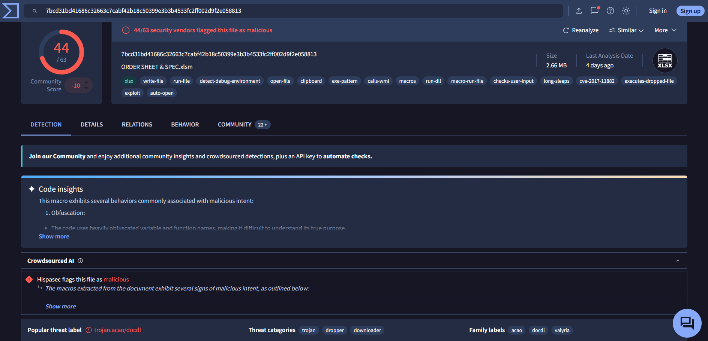
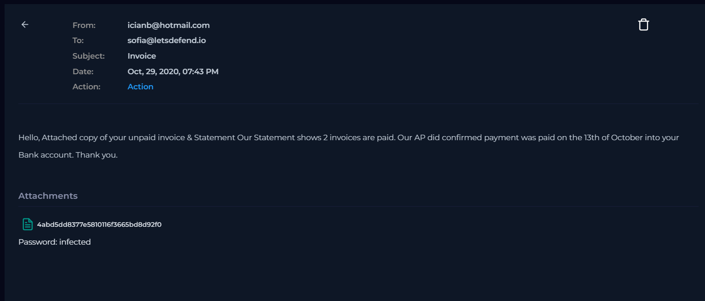
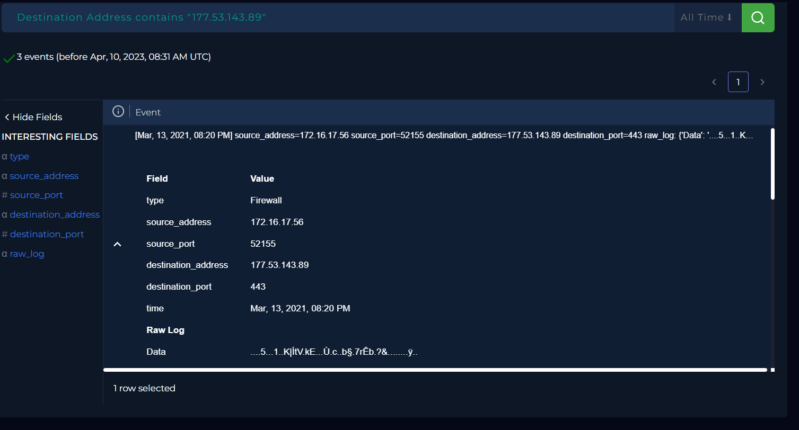
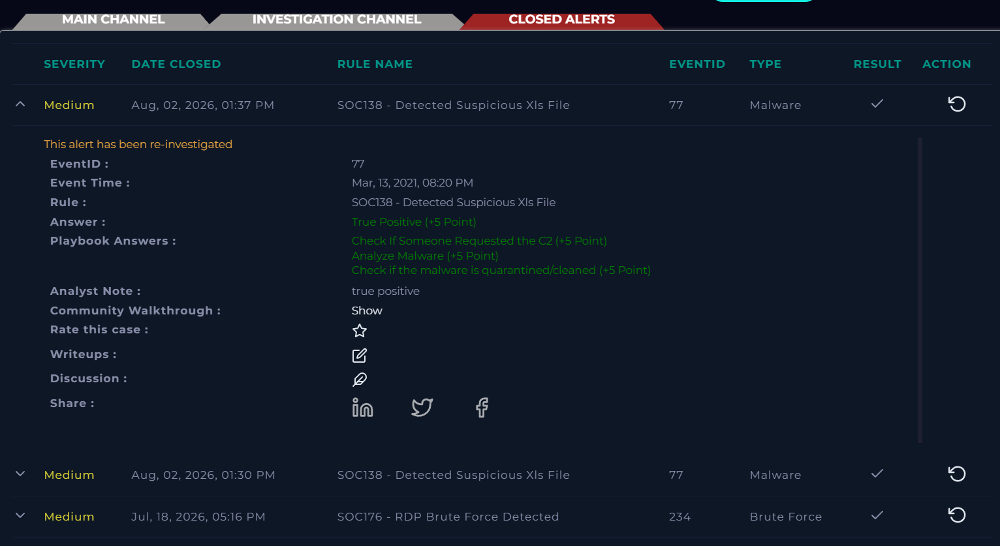

# SOC138 - Detected Suspicious Xls File (LetsDefend)

## What I Built

Investigated a LetsDefend SOC alert where an employee ("Sofia") received a phishing email with a macro-enabled Excel attachment disguised as an invoice. Traced the file through hash reputation, email headers, and network logs to confirm it was a malicious downloader and closed the alert as a True Positive.

## Steps Taken

1. Reviewed alert details (EventID 77, host: Sofia, file: `ORDER SHEET & SPEC.xlsm`, hash: `7ccf88c0bbe3b29bf19d877c4596a8d4`)
2. Checked the file hash on VirusTotal → 44/63 vendors flagged it malicious
3. Reviewed VT family labels → `docdl` (document downloader), `Valyria` (malicious macro doc family)
4. Checked Email logs → phishing email from a personal Hotmail address impersonating an unpaid invoice
5. Checked Network/Firewall logs → outbound connection to an external IP on port 443 at the exact alert timestamp
6. Checked the destination IP on VirusTotal → not flagged (noted as inconclusive, not disqualifying)
7. Marked the alert as **True Positive - Malicious** and closed it

## Why This Matters

| Step | Why it matters |
|---|---|
| Hash check first | Fastest way to check if a file is known-bad, without ever opening the actual payload |
| Family labels (docdl/Valyria) | Reveal the file's *role* (a downloader, not the final malware) — tells you to look for outbound activity next, not just local damage |
| Email header review | Personal Hotmail address sending a "business invoice" is a classic phishing/BEC red flag — ties the file evidence back to the human deception that got it opened |
| Firewall log correlation | Proves the macro actually executed and reached out — separates "suspicious file present" from "confirmed malicious execution" |
| Clean VT result on destination IP | Doesn't clear it — attackers rotate C2 infrastructure fast, so absence of detection isn't proof of safety |

## Screenshots

*44/63 vendors flagged the file malicious, with docdl/Valyria family labels.*

*Email header showing a personal Hotmail sender impersonating an invoice.*

*Outbound connection to external IP on port 443, matching the alert timestamp.*

*Alert marked True Positive and closed.*

## Skills Demonstrated

- Malware triage using hash-based threat intelligence (VirusTotal)
- Phishing email analysis and sender legitimacy verification
- Network log correlation (firewall/proxy) to confirm malicious execution
- SOC alert lifecycle: investigation → verdict → closure
- Critical evaluation of inconclusive threat intel (not over-trusting a single data point)
